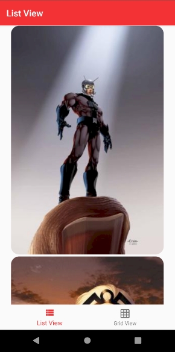
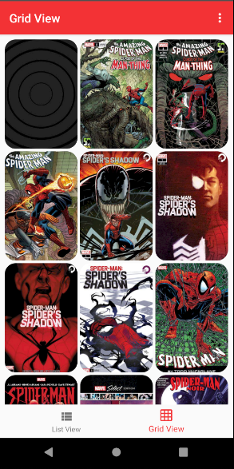
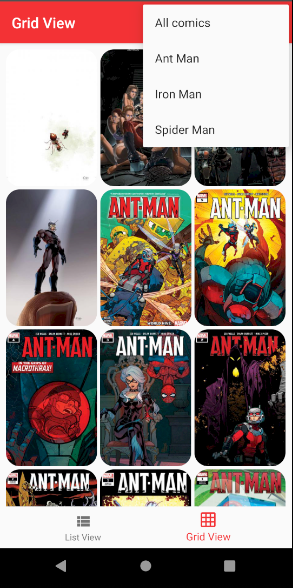
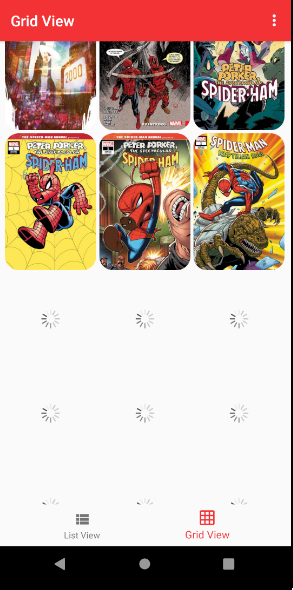
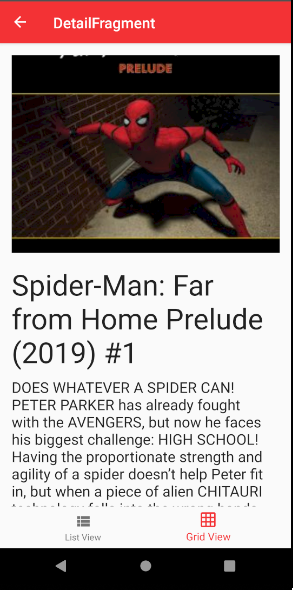

# RetrofitGlideRV

This is example app for connection to [**Marvel Comic API**](https://developer.marvel.com/)

## Libraries

* [Retrofit](https://square.github.io/retrofit/) to call to an HTTP web service
* [Moshi](https://github.com/square/moshi) deserialize JSON to Kotlin data objects 
* [Glide](https://bumptech.github.io/glide/) load images by URL.
  
Other patterns and components

* ViewModel
* LiveData
* Coroutines
* Data Binding
* RecyclerView
* Navigation
* OverflowMenu

## Screenshots

